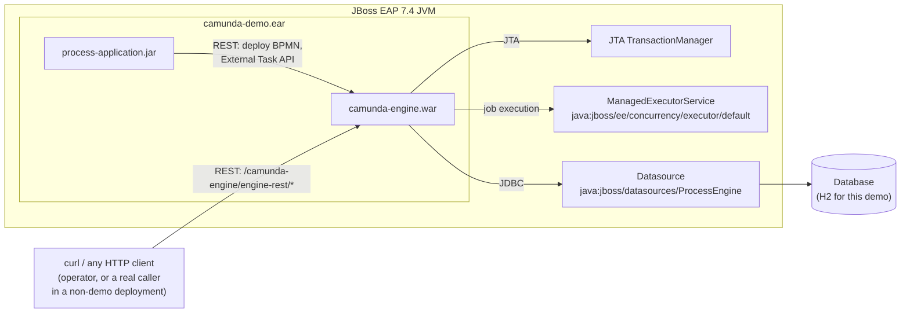

[← back to index](README.md)

# 3. System Scope and Context

## 3.1 Business/Domain Context

There's no real "business domain" here beyond the demo process itself (a
trivial start → async service task → external task → end flow, chosen to
exercise both halves of Camunda's execution model - see [Runtime View](06-runtime-view.md)).
The actual subject under study is the *deployment and integration
architecture*, not a business process.

## 3.2 Technical Context

| Neighbor | Relationship |
|---|---|
| **JBoss EAP 7.4** | The host application server. Provides the JTA `TransactionManager`, the `ManagedExecutorService`, the servlet/JAX-RS container (RESTEasy), and EJB/CDI containers. Everything this project is *about* is how the EAR uses these, rather than managing its own equivalents. |
| **Database** | A plain JDBC datasource, configured on the server (not bundled in the EAR - see [ADR](09-architecture-decisions.md)). H2 for this demo; any JTA-capable JDBC driver works in principle. |
| **REST clients** | Anything that talks to `/camunda-engine/engine-rest/*` - in this demo, that's `process-application`'s own `DemoProcessDeployer` and `DemoExternalTaskWorker`, plus whatever a human or script uses to start/inspect process instances (`curl`, Camunda's own tooling, etc.). In a non-demo deployment, this is where real external systems would integrate. |

## 3.3 Explicitly Out of Scope

- **A production-representative database.** H2, in-memory, no HA, no
  connection pool tuning beyond defaults - see [Risks and Technical Debt](11-risks-and-technical-debt.md).
- **Security** (authentication/authorization on the REST API, TLS). Not
  configured; irrelevant to the container-integration question this
  project is about.
- **Multi-node/clustered JBoss EAP.** The Job Executor's container-managed
  thread pool story doesn't fundamentally change in a cluster, but nothing
  here has been tested that way.
- **Real JBoss EAP 7.4.** Tested against WildFly, EAP's free upstream - see
  [ADR](09-architecture-decisions.md) and [Risks and Technical Debt](11-risks-and-technical-debt.md).
