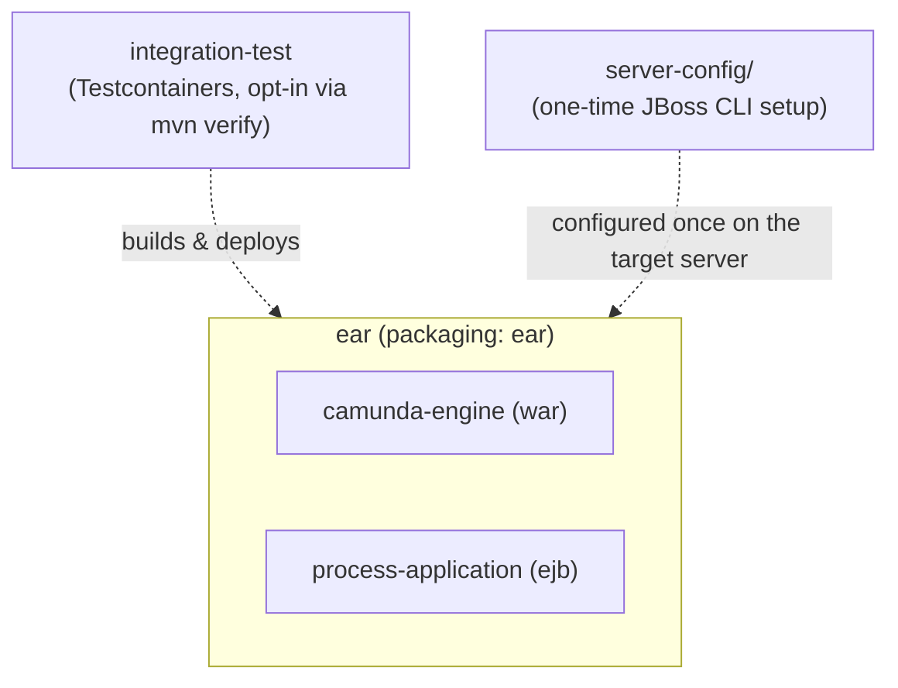

[← back to index](README.md)

# 5. Building Block View

## 5.1 Level 1: Whitebox Overall System

| Module | Packaging | Responsibility |
|---|---|---|
| `camunda-engine` | `war` | The process engine and nothing else: bootstrap, the container-managed Job Executor, the embedded REST API. No process definitions or business logic. |
| `process-application` | `ejb` | The demo BPMN process, its REST-based deployer, and its External Task worker. No compile-time dependency on `camunda-engine`. |
| `ear` | `ear` | Assembles the two above into one deployable unit, plus the third-party jars they need (`ear/lib/`). |
| `integration-test` | `jar` (test-only) | Builds a WildFly container, deploys the EAR onto it, and asserts the demo process runs and that job execution really lands on JBoss's managed thread pool. |
| `server-config/` | n/a (scripts) | JBoss CLI script to create the `ProcessEngine` datasource on a real server - the one piece of setup this project doesn't put inside the EAR. |

## 5.2 Level 2: `camunda-engine`

| Building Block | Responsibility |
|---|---|
| `camunda.cfg.xml` | Declares the `processEngineConfiguration` bean (`JtaProcessEngineConfiguration`) and the `jobExecutor` bean, declaratively - no Java bootstrap code for engine *configuration*. |
| `CamundaEngineBootstrap` | `@ApplicationScoped` CDI bean; `@Observes @Initialized(ApplicationScoped.class)`/`@Destroyed` drive `ProcessEngines.init()`/`.destroy()` at webapp start/stop. Also `@Produces` the `ProcessEngine` as an injectable CDI bean for future use. |
| `ManagedJobExecutor` | Custom `JobExecutor`; routes job *execution* to `java:jboss/ee/concurrency/executor/default` instead of a self-managed thread pool. See [Crosscutting Concepts §8.1](08-crosscutting-concepts.md). |
| `CamundaRestApplication` | JAX-RS `Application` embedding `camunda-engine-rest-core`'s resources under `/engine-rest`. |
| `META-INF/services/org.camunda.bpm.engine.rest.spi.ProcessEngineProvider` | Wires `ContainerManagedProcessEngineProvider`, which resolves REST requests against the plain `ProcessEngines` registry (no subsystem/`BpmPlatform` involved). |
| `web.xml` | Declares `FetchAndLockContextListener` (required by the External Task REST API - see [Risks and Technical Debt](11-risks-and-technical-debt.md)). |
| `beans.xml` | Makes this WAR a recognized CDI bean archive - required for `CamundaEngineBootstrap` to be discovered at all. |

## 5.3 Level 2: `process-application`

| Building Block | Responsibility |
|---|---|
| `demo-process.bpmn` | start → (`asyncBefore`) external service task (topic `demo-topic`) → end. The `asyncBefore` flag exists specifically so the Job Executor has something to do - see [Runtime View](06-runtime-view.md). |
| `DemoProcessDeployer` | `@Singleton @Startup` EJB; `POST`s the BPMN to the engine's `/deployment/create` REST endpoint at startup, with retries (JBoss's `ManagedExecutorService`, not a raw `Thread`). |
| `DemoExternalTaskWorker` | `@Singleton @Startup` EJB; uses `camunda-external-task-client` to long-poll, fetch, and complete the demo task over REST. |
