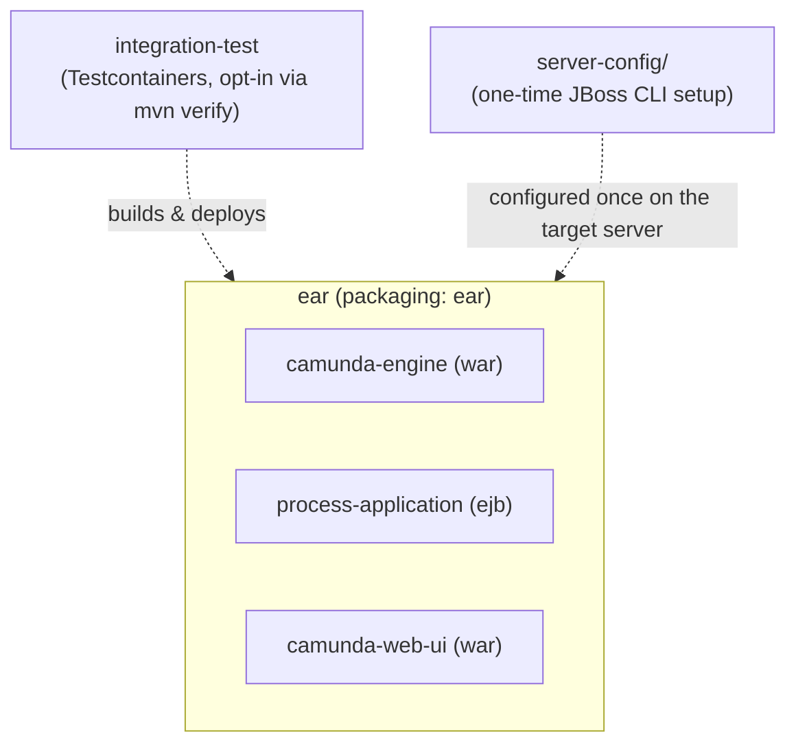

[← back to index](README.md)

# 5. Building Block View

## 5.1 Level 1: Whitebox Overall System

| Module | Packaging | Responsibility |
|---|---|---|
| `camunda-engine` | `war` | The process engine and nothing else: bootstrap, the container-managed Job Executor, the embedded REST API. No process definitions or business logic. |
| `process-application` | `ejb` | The demo BPMN process, its REST-based deployer, and its External Task worker. No compile-time dependency on `camunda-engine`. |
| `camunda-web-ui` | `war` | Cockpit/Tasklist/Admin - Camunda's prebuilt `camunda-webapp` WAR, overlaid as-is. Genuinely separate subdeployment, but *not* REST-decoupled like `process-application` - it needs direct Java-API access to the running `ProcessEngine`. See §5.4. |
| `ear` | `ear` | Assembles the three above into one deployable unit, plus the third-party jars they need (`ear/lib/`). |
| `integration-test` | `jar` (test-only) | Builds a WildFly container, deploys the EAR onto it, and asserts the demo process runs, that job execution really lands on JBoss's managed thread pool, and that `camunda-web-ui` actually resolves the shared engine (a real login against it, not just "the WAR deployed"). |
| `server-config/` | n/a (scripts) | JBoss CLI script to create the `ProcessEngine` datasource on a real server - the one piece of setup this project doesn't put inside the EAR. |

## 5.2 Level 2: `camunda-engine`

| Building Block | Responsibility |
|---|---|
| `camunda.cfg.xml` | Declares the `processEngineConfiguration` bean (`JtaProcessEngineConfiguration`) and the `jobExecutor` bean, declaratively - no Java bootstrap code for engine *configuration*. |
| `CamundaEngineBootstrap` | `@ApplicationScoped` CDI bean; `@Observes @Initialized(ApplicationScoped.class)`/`@Destroyed` drive `ProcessEngines.init()`/`.destroy()` at webapp start/stop. Also `@Produces` the `ProcessEngine` as an injectable CDI bean for future use. |
| `ManagedJobExecutor` | Custom `JobExecutor`; routes job *execution* to `java:jboss/ee/concurrency/executor/default` instead of a self-managed thread pool. See [Crosscutting Concepts §8.1](08-crosscutting-concepts.md). |
| `CamundaRestApplication` | JAX-RS `Application` embedding `camunda-engine-rest-core`'s resources under `/engine-rest`. |
| `META-INF/services/org.camunda.bpm.engine.rest.spi.ProcessEngineProvider` | Wires `ContainerManagedProcessEngineProvider`, which resolves REST requests against the plain `ProcessEngines` registry (no subsystem/`BpmPlatform` involved). |
| `web.xml` | Declares `FetchAndLockContextListener` (required by the External Task REST API - see [Risks and Technical Debt](11-risks-and-technical-debt.md)). |
| `beans.xml` | Makes this WAR a recognized CDI bean archive - required for `CamundaEngineBootstrap` to be discovered at all. |

## 5.3 Level 2: `process-application`

| Building Block | Responsibility |
|---|---|
| `demo-process.bpmn` | start → (`asyncBefore`) external service task (topic `demo-topic`) → end. The `asyncBefore` flag exists specifically so the Job Executor has something to do - see [Runtime View](06-runtime-view.md). |
| `DemoProcessDeployer` | `@Singleton @Startup` EJB; `POST`s the BPMN to the engine's `/deployment/create` REST endpoint at startup, with retries (JBoss's `ManagedExecutorService`, not a raw `Thread`). |
| `DemoExternalTaskWorker` | `@Singleton @Startup` EJB; uses `camunda-external-task-client` to long-poll, fetch, and complete the demo task over REST. |

## 5.4 Level 2: `camunda-web-ui`

No custom Java code - the module's entire `src/` is a `pom.xml`. Everything
(Cockpit/Tasklist/Admin's servlets, filters, listeners, static SPA assets)
comes from a `maven-war-plugin` overlay of `org.camunda.bpm.webapp:camunda-webapp`.

| Building Block | Responsibility |
|---|---|
| `camunda-webapp` overlay | The full prebuilt WAR content, merged in unmodified: `ProcessEnginesFilter`, `CockpitContainerBootstrap`/`AdminContainerBootstrap`/`TasklistContainerBootstrap`/`WelcomeContainerBootstrap`, `CsrfPreventionFilter`, `SecurityFilter`, and each app's own embedded REST servlet (`/api/engine`, `/api/cockpit`, `/api/admin`, `/api/tasklist`). |

**How it sees the shared engine without any explicit wiring.** This WAR is
its own EAR subdeployment - `ear-subdeployments-isolated=true` still
applies, so it can't see `camunda-engine.war`'s classes directly. It
doesn't need to: the artifact's own `WEB-INF/lib` deliberately does *not*
bundle `camunda-engine.jar` (confirmed by inspecting the published
artifact directly, not assumed), and `ear/lib/camunda-engine.jar` is
visible to every subdeployment regardless of the isolation setting (that
setting only blocks subdeployments from seeing each other's *own*
classes, not the shared `ear/lib/`). So `ProcessEnginesFilter`'s
`ProcessEngines.getProcessEngines()` call resolves against the exact same
loaded class, and therefore the exact same registered engine, that
`CamundaEngineBootstrap` in `camunda-engine.war` initialized - no
`jboss-deployment-structure.xml` module dependency between the two WARs
required. Verified end-to-end by `integration-test`'s
`webUiLoginWorksAgainstSharedEngine` test: a real CSRF-protected login as
the seeded `admin` user (see [`IdentityBootstrap`](../../camunda-engine/src/main/java/com/example/camunda/IdentityBootstrap.java)),
asserting the response actually names the `"default"` engine's authorized
apps - not reachable unless the webapp is looking at the real, running engine.

**Same JSON-B/Jackson gotcha as `camunda-engine.war`.** This WAR embeds
its own RESTEasy + Jackson JAX-RS servlets the same way `camunda-engine.war`
does, so it needs the identical `org.jboss.resteasy.resteasy-json-binding-provider`
exclusion in `jboss-deployment-structure.xml` - see
[Crosscutting Concepts §8.4](08-crosscutting-concepts.md) and the
`jboss-eap` skill.
