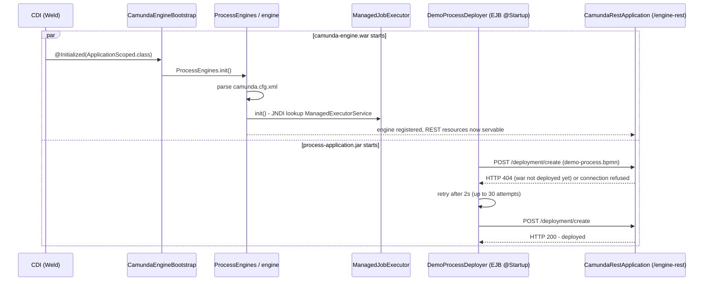
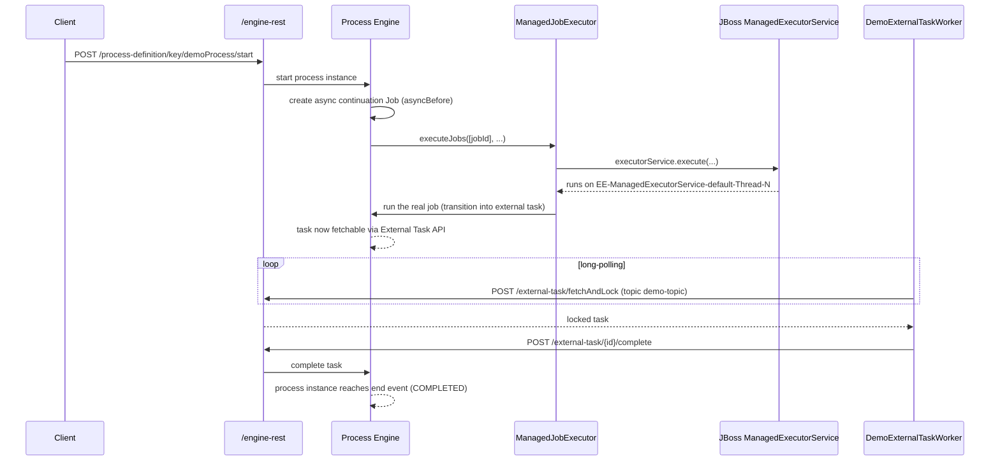

[← back to index](README.md)

# 6. Runtime View

## 6.1 Scenario: EAR Startup

Two subdeployments initialize independently and racily - by design (see
[ADR: decouple via REST only](09-architecture-decisions.md)) - so
`DemoProcessDeployer` has to tolerate the engine not being ready yet.

Confirmed against a real container (see [integration tests](../../integration-test)):
a handful of `HTTP 404`/connection-refused attempts in the first couple of
seconds, then both sides settle - no manual intervention needed.

## 6.2 Scenario: Starting and Completing the Demo Process

This is the scenario that exercises *both* halves of the container
integration story - the Job Executor's thread pool, and the fully
REST-decoupled external task worker - in one flow.

The [integration test suite](../../integration-test) asserts this scenario
end-to-end, and specifically correlates the *exact* job id (looked up from
the engine's own History REST API) with a log line showing that job
executing on an `EE-ManagedExecutorService-default-Thread-N` thread -
see [Risks and Technical Debt §11.4](11-risks-and-technical-debt.md) for
why a weaker check (thread name present *somewhere*) wasn't good enough.
