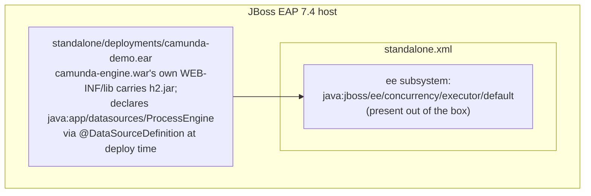
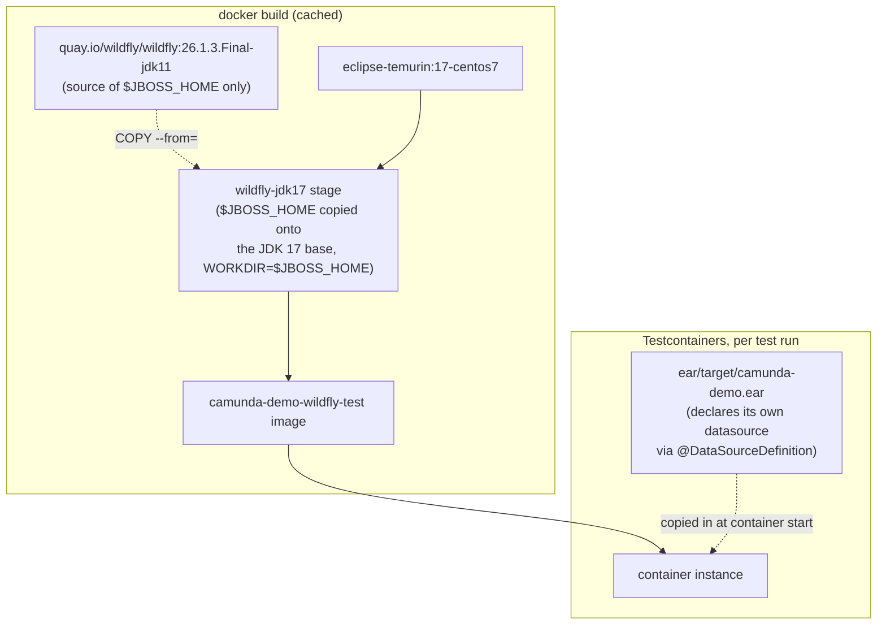

[← back to index](README.md)

# 7. Deployment View

Two deployment shapes exist side by side: the "real" one (a JBoss EAP
instance you set up and deploy to by hand) and the "test" one (a
Testcontainers-built WildFly image, assembled and torn down automatically).
They're deliberately close to each other - the test image exists to give
the real deployment steps something to be verified against.

## 7.1 Production-Shaped Deployment

Steps (see the top-level [README](../../README.md) for the exact commands):

1. `cp ear/target/camunda-demo.ear $JBOSS_HOME/standalone/deployments/`.

That's it - **no server-side setup at all**. The `ProcessEngine`
datasource is declared inside the EAR via `@DataSourceDefinition` on
`camunda-engine`'s `CamundaEngineBootstrap`, and the H2 driver it needs is
bundled directly into `camunda-engine.war`'s own `WEB-INF/lib`
(`camunda-engine/pom.xml` ships `com.h2database:h2` at `runtime` scope,
not `test`) - so both the datasource and its driver deploy/undeploy with
the application (see [ADR-4](09-architecture-decisions.md)). WildFly
resolves `@DataSourceDefinition`'s `className` by loading it through the
deployment's own module classloader, which is exactly why bundling the
driver jar directly in the WAR is enough - no server module, no
`jboss-deployment-structure.xml` dependency entry needed (confirmed by
deploying to a completely stock WildFly with nothing pre-installed).

## 7.2 Test Deployment (`integration-test/`)

Key differences from the production shape, and why:

- **WildFly, not JBoss EAP** - real EAP images require a Red Hat
  subscription; WildFly 26.1.3.Final is EAP 7.4's freely-available
  upstream on the same `javax.*` codebase generation. See
  [ADR](09-architecture-decisions.md) and
  [Risks and Technical Debt](11-risks-and-technical-debt.md) for what this
  does and doesn't verify.
- **$JBOSS_HOME copied onto a JDK 17 base, not quay.io's prebuilt jdk17
  image** - quay.io never published a `wildfly:26.1.3.Final-jdk17` tag
  (its jdk17 tags only start at WildFly 28, which is Jakarta EE 10 -
  outside this project's `javax.*` target). The `Dockerfile`'s
  `wildfly-jdk17` stage copies the already-installed `$JBOSS_HOME` out of
  quay.io's jdk11-tagged image (a normal, fast registry pull) onto a JDK
  17 base, rather than downloading the WildFly release tarball straight
  from GitHub Releases the way the upstream `wildfly/wildfly-container`
  Dockerfile does - that CDN throttled to ~20 KB/s in testing here,
  turning a ~200MB download into hours.
- **No datasource, and no driver, baked into the image at all** - both are
  bundled straight into `camunda-engine.war` and deploy with the EAR the
  same way in both shapes (§7.1), so there's nothing server-side left to
  bake in here either.
- **`WORKDIR $JBOSS_HOME`, not Docker's default (image root)** - the
  relative H2 file URL in `@DataSourceDefinition`
  (`./camunda-h2-database/...`) resolves against the JVM's `user.dir`,
  which is wherever `standalone.sh` was launched from. `$JBOSS_HOME` is
  `chmod -R g+rw`'d for the `jboss` user earlier in the build; the parent
  `/opt/jboss` is not. Found by deploying with the default `WORKDIR
  /opt/jboss` and hitting `Error while creating file
  /opt/jboss/camunda-h2-database` - a real EAP host normally launches
  `standalone.sh` from within `$JBOSS_HOME` too (interactively from
  `bin/`, or via a service unit's `WorkingDirectory`), so this also makes
  the test image more representative of that, not just a workaround.
- **In-memory H2 was previously used here** (ephemeral containers, no
  volume) but the shared `@DataSourceDefinition` declaration means both
  shapes now use the same file-based URL as production; the `WORKDIR` fix
  above is what makes that safe to share.
- **The EAR is copied in at container start, not baked into the image** -
  keeps the Docker layer cache valid across ordinary rebuilds of the EAR.

## 7.3 CI

GitHub Actions (`.github/workflows/ci.yml`), `ubuntu-latest`: checks out,
sets up JDK 17, runs `mvn -B verify`. GitHub-hosted runners have Docker
preinstalled, so the integration tests need no additional CI setup.
