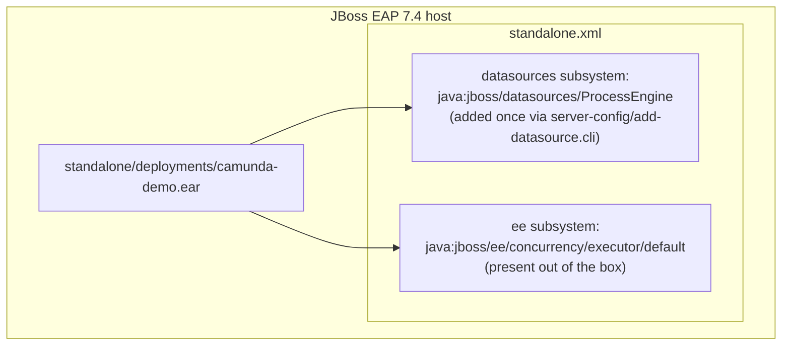
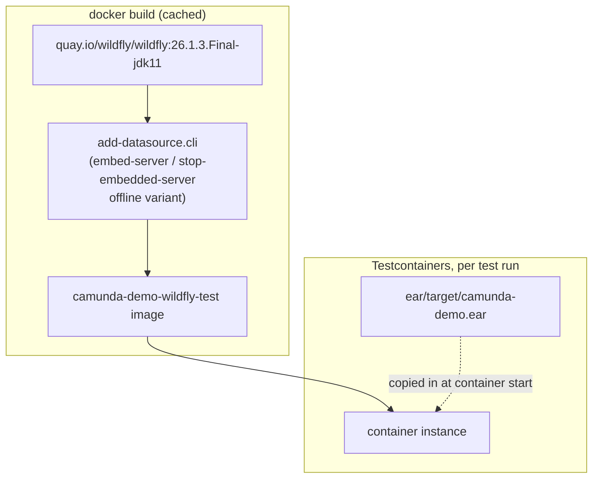

[← back to index](README.md)

# 7. Deployment View

Two deployment shapes exist side by side: the "real" one (a JBoss EAP
instance you set up and deploy to by hand) and the "test" one (a
Testcontainers-built WildFly image, assembled and torn down automatically).
They're deliberately close to each other - the test image exists to give
the real deployment steps something to be verified against.

## 7.1 Production-Shaped Deployment (`server-config/`)

Steps (see the top-level [README](../../README.md) for the exact commands):

1. Run `server-config/add-datasource.cli` once against the target server -
   the only server-side setup this project requires.
2. `cp ear/target/camunda-demo.ear $JBOSS_HOME/standalone/deployments/`.

Nothing else is installed on the server: no subsystem module, no extra
JBoss configuration beyond that one datasource.

## 7.2 Test Deployment (`integration-test/`)

Key differences from the production shape, and why:

- **WildFly, not JBoss EAP** - real EAP images require a Red Hat
  subscription; WildFly 26.1.3.Final is EAP 7.4's freely-available
  upstream on the same `javax.*` codebase generation. See
  [ADR](09-architecture-decisions.md) and
  [Risks and Technical Debt](11-risks-and-technical-debt.md) for what this
  does and doesn't verify.
- **Datasource baked into the image at build time**, not applied via a
  running-server CLI call - `embed-server`/`stop-embedded-server` edits
  `standalone.xml` without booting the server, so this layer is cached
  across ordinary test runs.
- **In-memory H2**, not file-based - containers are ephemeral, so there's
  no reason to persist data across runs.
- **The EAR is copied in at container start, not baked into the image** -
  keeps the Docker layer cache valid across ordinary rebuilds of the EAR;
  only the (rarely-changing) datasource/driver layer is cached at the
  image level.

## 7.3 CI

GitHub Actions (`.github/workflows/ci.yml`), `ubuntu-latest`: checks out,
sets up JDK 11, runs `mvn -B verify`. GitHub-hosted runners have Docker
preinstalled, so the integration tests need no additional CI setup.
